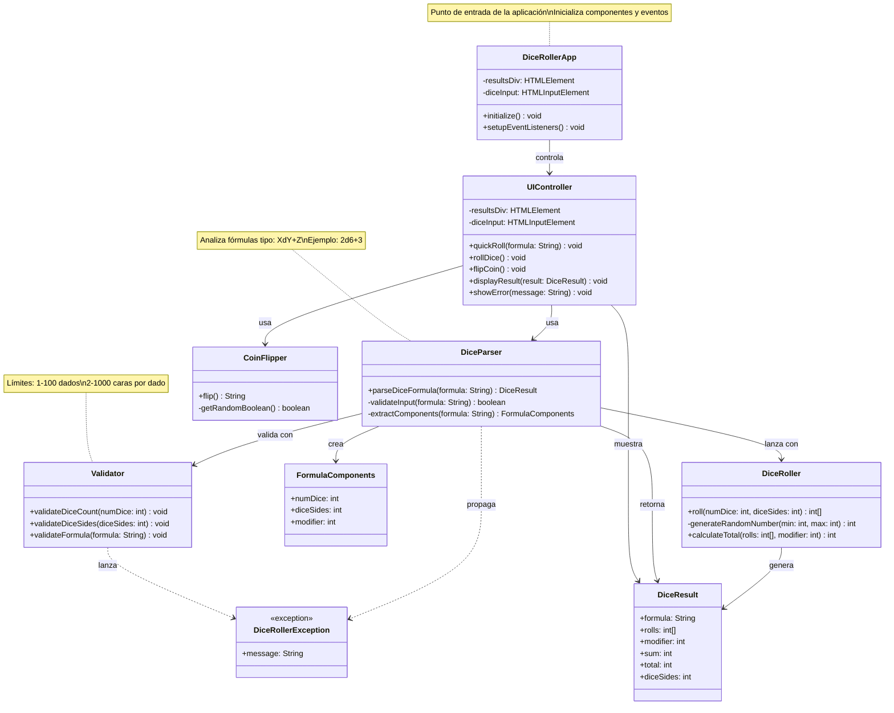

# diagrama de clases

```mermaid
classDiagram
direction TB

class DiceRollerApp {
    -resultsDiv: HTMLElement
    -diceInput: HTMLInputElement
    +initialize() void
    +setupEventListeners() void
}

class UIController {
    -resultsDiv: HTMLElement
    -diceInput: HTMLInputElement
    +quickRoll(formula: String) void
    +rollDice() void
    +flipCoin() void
    +displayResult(result: DiceResult) void
    +showError(message: String) void
}

class DiceParser {
    +parseDiceFormula(formula: String) DiceResult
    -validateInput(formula: String) boolean
    -extractComponents(formula: String) FormulaComponents
}

class DiceRoller {
    +roll(numDice: int, diceSides: int) int[]
    -generateRandomNumber(min: int, max: int) int
    +calculateTotal(rolls: int[], modifier: int) int
}

class DiceResult {
    +formula: String
    +rolls: int[]
    +modifier: int
    +sum: int
    +total: int
    +diceSides: int
}

class FormulaComponents {
    +numDice: int
    +diceSides: int
    +modifier: int
}

class CoinFlipper {
    +flip() String
    -getRandomBoolean() boolean
}

class Validator {
    +validateDiceCount(numDice: int) void
    +validateDiceSides(diceSides: int) void
    +validateFormula(formula: String) void
}

class DiceRollerException {
    <<exception>>
    +message: String
}

%% Relaciones
DiceRollerApp --> UIController : controla
UIController --> DiceParser : usa
UIController --> CoinFlipper : usa
UIController --> DiceResult : muestra
DiceParser --> Validator : valida con
DiceParser --> DiceRoller : lanza con
DiceParser --> FormulaComponents : crea
DiceParser --> DiceResult : retorna
DiceRoller --> DiceResult : genera
Validator ..> DiceRollerException : lanza
DiceParser ..> DiceRollerException : propaga

%% Notas
note for DiceRollerApp "Punto de entrada de la aplicación\nInicializa componentes y eventos"
note for DiceParser "Analiza fórmulas tipo: XdY+Z\nEjemplo: 2d6+3"
note for Validator "Límites: 1-100 dados\n2-1000 caras por dado"
```
