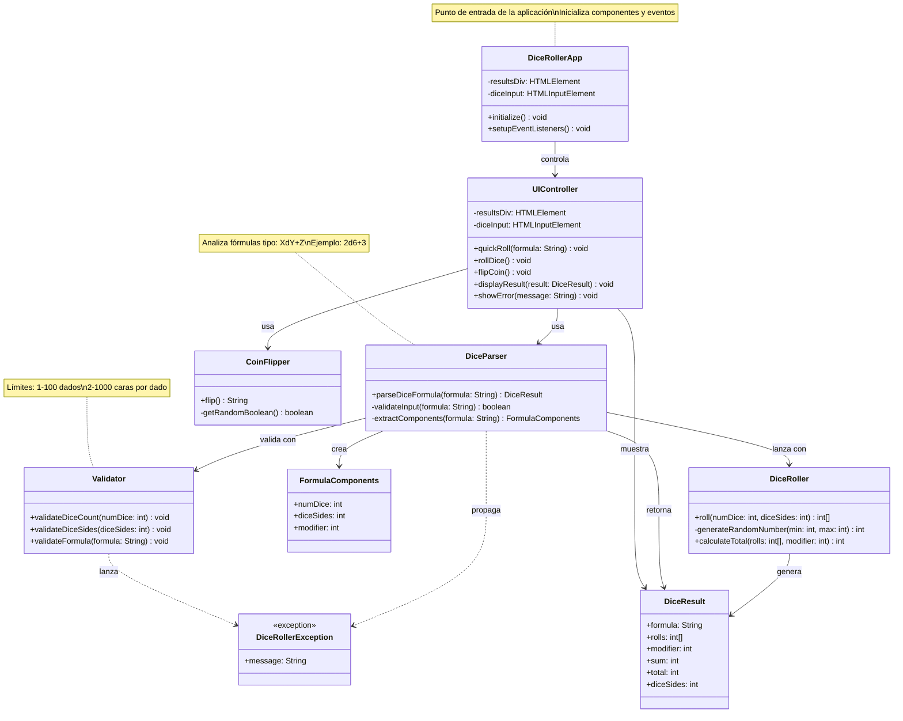
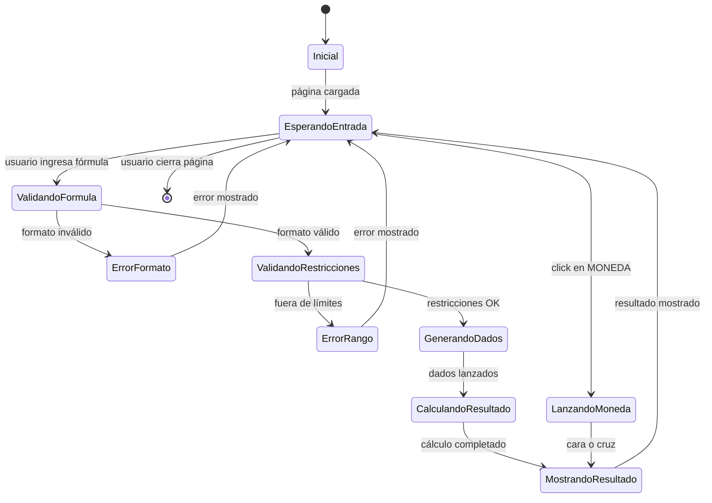
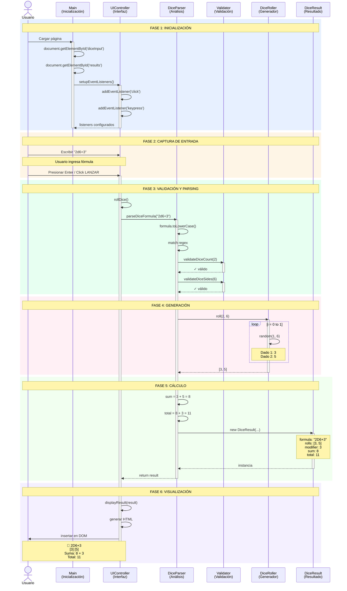

# Diagrama de clases

```mermaid
classDiagram
direction TB

class DiceRollerApp {
    -resultsDiv: HTMLElement
    -diceInput: HTMLInputElement
    +initialize() void
    +setupEventListeners() void
}

class UIController {
    -resultsDiv: HTMLElement
    -diceInput: HTMLInputElement
    +quickRoll(formula: String) void
    +rollDice() void
    +flipCoin() void
    +displayResult(result: DiceResult) void
    +showError(message: String) void
}

class DiceParser {
    +parseDiceFormula(formula: String) DiceResult
    -validateInput(formula: String) boolean
    -extractComponents(formula: String) FormulaComponents
}

class DiceRoller {
    +roll(numDice: int, diceSides: int) int[]
    -generateRandomNumber(min: int, max: int) int
    +calculateTotal(rolls: int[], modifier: int) int
}

class DiceResult {
    +formula: String
    +rolls: int[]
    +modifier: int
    +sum: int
    +total: int
    +diceSides: int
}

class FormulaComponents {
    +numDice: int
    +diceSides: int
    +modifier: int
}

class CoinFlipper {
    +flip() String
    -getRandomBoolean() boolean
}

class Validator {
    +validateDiceCount(numDice: int) void
    +validateDiceSides(diceSides: int) void
    +validateFormula(formula: String) void
}

class DiceRollerException {
    <<exception>>
    +message: String
}

%% Relaciones
DiceRollerApp --> UIController : controla
UIController --> DiceParser : usa
UIController --> CoinFlipper : usa
UIController --> DiceResult : muestra
DiceParser --> Validator : valida con
DiceParser --> DiceRoller : lanza con
DiceParser --> FormulaComponents : crea
DiceParser --> DiceResult : retorna
DiceRoller --> DiceResult : genera
Validator ..> DiceRollerException : lanza
DiceParser ..> DiceRollerException : propaga

%% Notas
note for DiceRollerApp "Punto de entrada de la aplicación\nInicializa componentes y eventos"
note for DiceParser "Analiza fórmulas tipo: XdY+Z\nEjemplo: 2d6+3"
note for Validator "Límites: 1-100 dados\n2-1000 caras por dado"
```

# Diagrama de secuencia

```mermaid
stateDiagram-v2
    [*] --> Inicial
    
    Inicial --> EsperandoEntrada : página cargada
    EsperandoEntrada --> ValidandoFormula : usuario ingresa fórmula
    EsperandoEntrada --> LanzandoMoneda : click en MONEDA
    
    ValidandoFormula --> ErrorFormato : formato inválido
    ValidandoFormula --> ValidandoRestricciones : formato válido
    
    ValidandoRestricciones --> ErrorRango : fuera de límites
    ValidandoRestricciones --> GenerandoDados : restricciones OK
    
    GenerandoDados --> CalculandoResultado : dados lanzados
    CalculandoResultado --> MostrandoResultado : cálculo completado
    
    LanzandoMoneda --> MostrandoResultado : cara o cruz
    
    ErrorFormato --> EsperandoEntrada : error mostrado
    ErrorRango --> EsperandoEntrada : error mostrado
    MostrandoResultado --> EsperandoEntrada : resultado mostrado
    
    EsperandoEntrada --> [*] : usuario cierra página
```
# Diagrama de Estados

```mermaid
sequenceDiagram
    actor Usuario
    participant Main as Main<br/>(Inicialización)
    participant UI as UIController<br/>(Interfaz)
    participant Parser as DiceParser<br/>(Análisis)
    participant Valid as Validator<br/>(Validación)
    participant Roller as DiceRoller<br/>(Generador)
    participant Result as DiceResult<br/>(Resultado)
    
    rect rgb(230, 240, 255)
        Note over Usuario,Result: FASE 1: INICIALIZACIÓN
        Usuario->>Main: Cargar página
        activate Main
        Main->>Main: document.getElementById('diceInput')
        Main->>Main: document.getElementById('results')
        Main->>UI: setupEventListeners()
        activate UI
        UI->>UI: addEventListener('click')
        UI->>UI: addEventListener('keypress')
        UI-->>Main: listeners configurados
        deactivate UI
        deactivate Main
    end
    
    rect rgb(255, 245, 230)
        Note over Usuario,Result: FASE 2: CAPTURA DE ENTRADA
        Usuario->>UI: Escribir "2d6+3"
        Note over Usuario,UI: Usuario ingresa fórmula
        Usuario->>UI: Presionar Enter / Click LANZAR
        activate UI
    end
    
    rect rgb(230, 255, 240)
        Note over Usuario,Result: FASE 3: VALIDACIÓN Y PARSING
        UI->>UI: rollDice()
        UI->>Parser: parseDiceFormula("2d6+3")
        activate Parser
        
        Parser->>Parser: formula.toLowerCase()
        Parser->>Parser: match regex
        
        Parser->>Valid: validateDiceCount(2)
        activate Valid
        Valid-->>Parser: ✓ válido
        deactivate Valid
        
        Parser->>Valid: validateDiceSides(6)
        activate Valid
        Valid-->>Parser: ✓ válido
        deactivate Valid
    end
    
    rect rgb(255, 240, 245)
        Note over Usuario,Result: FASE 4: GENERACIÓN
        Parser->>Roller: roll(2, 6)
        activate Roller
        
        loop i = 0 to 1
            Roller->>Roller: random(1, 6)
            Note over Roller: Dado 1: 3<br/>Dado 2: 5
        end
        
        Roller-->>Parser: [3, 5]
        deactivate Roller
    end
    
    rect rgb(240, 255, 240)
        Note over Usuario,Result: FASE 5: CÁLCULO
        Parser->>Parser: sum = 3 + 5 = 8
        Parser->>Parser: total = 8 + 3 = 11
        
        Parser->>Result: new DiceResult(...)
        activate Result
        Note over Result: formula: "2D6+3"<br/>rolls: [3, 5]<br/>modifier: 3<br/>sum: 8<br/>total: 11
        Result-->>Parser: instancia
        deactivate Result
        
        Parser-->>UI: return result
        deactivate Parser
    end
    
    rect rgb(245, 240, 255)
        Note over Usuario,Result: FASE 6: VISUALIZACIÓN
        UI->>UI: displayResult(result)
        UI->>UI: generar HTML
        UI->>Usuario: insertar en DOM
        Note over Usuario,UI: 🎲 2D6+3<br/>[3] [5]<br/>Suma: 8 + 3<br/>Total: 11
        deactivate UI
    end
```
